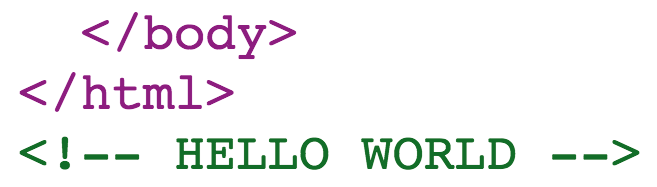

# Ember CLI's content-for helper and ember-cli-inline-content

> Text and demo code from Ember.YVR talk from September 14th, 2015.

Ember CLI's <code>content-for</code> helper appears a number of times in the default index.html file provided by Ember CLI, but outside of add-on development, it isn't widely used and has lead to some confusion on what it is. This talk/article is geared towards explaining what it is, how it works, and, further, provides some example uses of the addtional <em>ember-cli-inline-content</em> addon.

You can peruse/run the Ember application in the _content-for_ directory to view the simple example app we created for this demo. Also, the talk slides are located at _preso/index.html_. Much of the content in this _README.md_ is recreated in the slides.

## content-for

The content-for helper exposes hooks to insert string content into areas of your index template. You've probably seen these little helper calls in your entry point index.html, but if you're not developing an addon yet, you may not have known what they're for.


If you've used Rails before, you've probably seen this in the similarly named `content_for` helper. They call this a capture helper; you can capture content and then output it later.

```
/ action.html.slim

- content_for :head do
  javascript:
    console.log('Hello world');

p Hello world
```

```
/ layout.html.slim

html
  head
    = yield :head
```
        
This example shows and index action defining the content for :head that'll be injected into the layout. Content is captured in the lower content_for block and spit out by "yielding" in a layout.

In Ember CLI's case, the content-for helper is used to:

- inject the baseUrl variable into the `<base>` meta tag
- add a meta tag which contains the Ember Application's configuration


If we take a look at Ember CLI's implementation of `contentFor`, we'll see how this works.

The highlighted section shows Ember grabbing the result of `contentFor` for each installed addon and concatenating it into a string. The string is then displayed in your template based on the `type`. So if we're displaying the content for "head", Ember CLI is going to collect all string data returned by the installed addon's `contentFor` method and output it.

You can also see the `_contentForHead` call that adds the meta tag we saw earlier which contains the Ember app's config object.

By default, Ember CLI ships with support for a number of "hooks" or areas to display content:

- head
- head-footer
- body
- body-footer
- config-module
- app
- test-header-footer
- test-body-footer

As an addon developer, you can also create your own hooks for your addon consumer's to utilize. 

Adding content to a content-for area is pretty straightforward. If you're creating an addon, you will implement `contentFor` in your addon's entry point, _index.js_. You can even do this in an in-repo addon.

1. Create the in-repo addon

```
$ ember generate in-repo-addon soundcloud
```

2. Return your string content from `contentFor`

```
module.exports = {
  name: 'soundcloud',
  isDevelopingAddon: function() {
    return true;
  },
  contentFor: function(type, config) {
    if (type === 'body') {
      return '<script src="//w.soundcloud.com/player/api.js"></script>';
    }
  }
};
```

Let's say I was developing an addon that supplied a series of components for the Soundcloud Widget API. In this way, the api script source would be added to the index.html file just by installing the addon. 

## ember-cli-inline-content

This addon adds the ability to create your own named areas to inject inline content into. Where content-for only allows you to use the predefined hooks (or hooks made available by addon developers), ember-cli-inline-content allows you to define your own named hooks.

### Intalling 

From the root of your ember project, install via npm:

```
$ npm install --save-dev ember-cli-inline-content
```

### Displaying a string

The simplest use of the addon is to render a string in a named outlet. In your **Brocfile.js** or **ember-cli-build.js** add the configuration for `inlineContent`:

```
// ember-cli-build.js
var app = new EmberApp(defaults, {
  inlineContent: {
    'string-content': {
      content: '<!-- HELLO WORLD -->'
    }
  }
});
```

Then if we add a new content-for outlet at the end of our file, the content will be injected into it.

```
{{! app/index.html }}
</html>
{{content-for 'string-content'}}
```

The result:




### Displaying contents of a file

The second use case of the addon is rendering the contents of a file inline. Basic use is just assigning a file path to each key. The addon is designed to wrap the output in script or style tags based on the extension.

```
inlineContent: {
  'javascript-content': 'lib/file.js',
  'css-content': 'lib/file.css',
  'text-content': 'lib/file.txt'
}
```

```
{{content-for 'javascript-content'}}
{{content-for 'css-content'}}
{{content-for 'text-content'}}
```

### Post-Processing Content

You can also modify contents of a file before it's injected into the template. This is useful for modifying content based on an environment or other configuration detail.

The postProcess function defined on a custom outlet receives the content and returns the modified content:

```
inlineContent:
  'post-process-content': {
    file: 'lib/config.js',
    postProcess: function(content) {
      return content.replace(/\{\{CONFIG_THING_ID\}\}/g, config.CONFIG_THING_ID);
    }
  }
}
```

If our _lib/config.js_ file looked like so:

```
<!-- {{CONFIG_THING_ID}} -->
```

and we set CONFIG_THING_ID in our app's environment.js file:

```
if (environment === 'development') {
  ENV.CONFIG_THING_ID = '123';
}
```

The template would end up with 

```
<!-- 123 -->
```

rendered whereever you added the `{{content-for 'post-process-content'}}` helper call.
